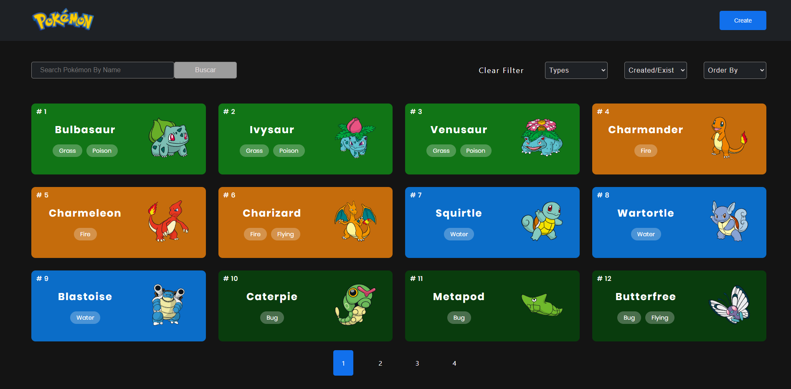
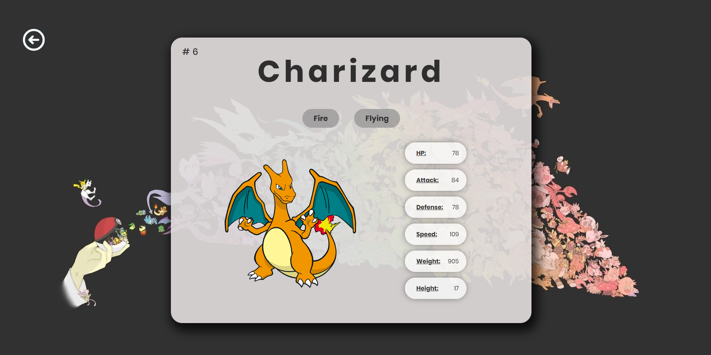
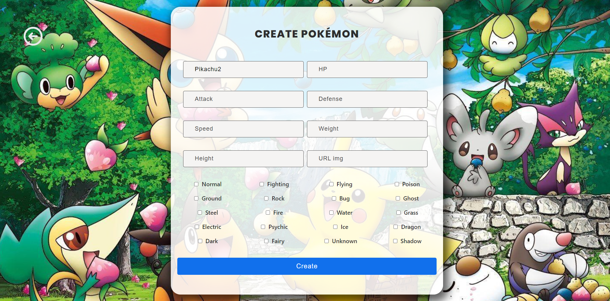

#### I am a creative, enterprising and self-taught person. Without a doubt I am very happy to have taken a turn in my professional development towards the programming side as it allows me to exploit all my qualities.

---

#### I am currently looking for new challenges that test my current capabilities as **Full Stack Developer**

---

## Contact me:

[Linkedin](https://www.linkedin.com/in/diegoabad-fullstack/)

---

## My stack of technologies are:

- JavaScript
- React
- Redux
- Mongo
- Mongoose
- Postgres
- Seaqualize
- Node
- Express
- C#
- Firebase

I am also interested in mobile development with **React Native**.

---

# Projects

## Pokemon App

#### Development of an SPA (Simple Page Application) using React for the FrontEnd and Redux to handle global states.

#### All applied styles are made with pure CSS without the use of external libraries. The SPA consumes API data (PokeApi) through a Back End developed in Node.JS using Express, adding new functionalities to the original Api. Also as a database use PostgresSQL with Seaqualize

---
