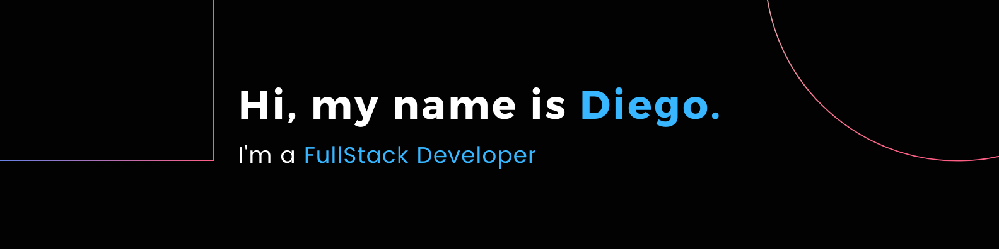
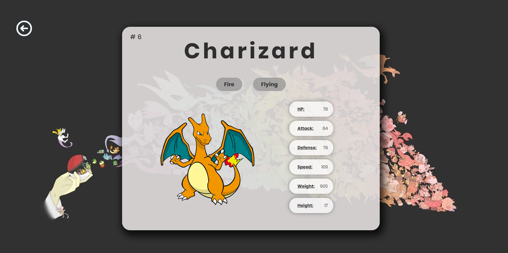

#### I am a creative, enterprising and self-taught person. Without a doubt I am very happy to have taken a turn in my professional development towards the programming side as it allows me to exploit all my qualities.

#### I am currently looking for new challenges that test my current capabilities as **Full Stack Developer**

---

## Contact me:

[Linkedin](https://www.linkedin.com/in/diegoabad-fullstack/)

---

## My stack of technologies are:

- JavaScript
- React
- Redux
- Mongo
- Mongoose
- Postgres
- Seaqualize
- Node
- Express
- C#
- Firebase

I am also interested in mobile development with **React Native**.

---

# Featured Projects

## Middleware App

#### Project carried out within a team of 8 developers using agile methodologies (SCRUM).

#### It consists of a platform that puts junior developers in contact with companies.

#### Among its outstanding features we find: chat between users, real-time notifications,integration with payment platform (MercadoPago), log-in system and user roles in addition to the use of TOKENS for the protection of all our routes.

#### Technologies used: React, Redux, Bootstrap, SocketIO, Firebase, JWT, Mongo, Node.JS and Express.

#### Highlights: Middleware App won second place by student vote.

### Github of my colleagues

- <a href="https://github.com/sritapam" target="_blank">Pamela Pereyra</a>
- <a href="https://github.com/Miguegithub78" target="_blank">Miguel Avalle</a>
- <a href="https://github.com/jesuanp" target="_blank">Jesuan Patermina</a>
- <a href="https://github.com/maxigadea" target="_blank">Maximiliano Gadea</a>
- <a href="https://github.com/anaangelicaf" target="_blank">Ana Fernandez</a>
- <a href="https://github.com/hernandiazz9" target="_blank">Hernan Diaz</a>
- <a href="https://github.com/Ailin09" target="_blank">Ailín Rutchle</a>

---

## Pokemon App

#### Development of an SPA (Simple Page Application) using React for the FrontEnd and Redux to handle global states.

#### All applied styles are made with pure CSS without the use of external libraries. The SPA consumes API data (PokeApi) through a Back End developed in Node.JS using Express, adding new functionalities to the original Api. Also as a database use PostgresSQL with Seaqualize

---
